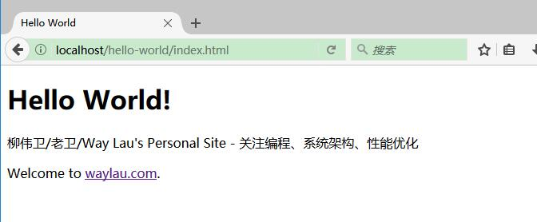

# Hello World! 作为 HTTP 服务器

按照编程惯例，我们要编写第一个“Hello World”应用案例。该案例是使用 NGINX 来作为 HTTP 服务器。

众所周知， NGINX 一款高性能的 HTTP 服务器。


## 编写示例代码

我们新建了一个“hello-world”目录，用作我们的项目目录。在该目录下，新建一个 index.html 静态页面，页面内容如下：

```html
<!DOCTYPE html>
<html>
<head>
<meta charset="UTF-8">
<title>Hello World</title>
</head>
<body>
	<h1>Hello World!</h1>
	<p>柳伟卫/老卫/Way Lau's Personal Site - 关注编程、系统架构、性能优化</p>
	<p>
		Welcome to <a href="https://waylau.com">waylau.com</a>.
	</p>
</body>
</html>
```

页面内容非常简单，我们只是考虑如何将这个静态页面在 NGINX 上进行部署。


## 部署项目 

在 NGINX 的按照目录下，我们能找到`html`目录，该目录就是用于部署静态页面。

在该目录下，事先已经有了几个演示页面：

```shell
├─html
│      50x.html
│      index.html
```

也可以删除，或者保留该演示页面。我们将“hello-world”项目复制到`html`目录下。

此时，整个目录情况如下：

```shell
├─html
│  │  50x.html
│  │  index.html
│  │
│  └─hello-world
│          index.html
```

## 验证
 
NGINX 正常启动后会占用，打开浏览器，访问<http://localhost/hello-world/index.html> 就能看到我们编写的项目的页面。



